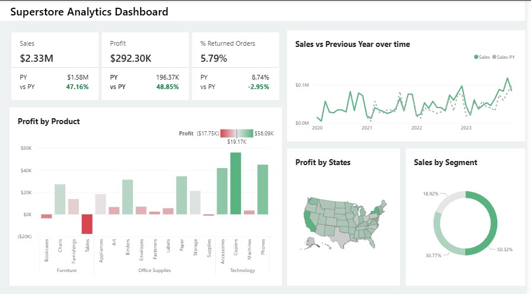

```markdown
# 📊 Superstore Analytics Dashboard

This project is a **Power BI dashboard** built on Superstore dataset to analyze key business metrics like sales, profit, returned orders, and product performance.  
The dashboard provides a clear picture of business growth, profitability, and customer behavior.


## 📷 Dashboard Preview



## 🔎 Overview
The dashboard highlights:
- **Sales & Profit Trends** compared to the previous year  
- **Returned Orders %** to track customer satisfaction  
- **Profit by Product Category** to identify top-performing and underperforming items  
- **Geographical Performance** through profit by states  
- **Sales Segmentation** for deeper business insights  

---

## ⚙️ Tools Used
- **Power BI**: For data modeling, visualization, and storytelling  
- **Excel / CSV Dataset**: Superstore dataset used for analysis  
- **GitHub**: Version control and project showcase  

---

## 🚀 Key Insights
- Sales increased by **47.16%** compared to the previous year.  
- Profit improved by **48.85%**, with Technology being the most profitable segment.  
- Returned orders dropped slightly, improving operational efficiency.  
- California and New York contributed the highest profit margins.  

---

## 📂 Repository Structure
```

📁 Superstore-Dashboard
┣ 📊 Dashboard.pbix
┣ 🖼️ Dashboard.jpg
┣ 📄 README.md
┗ 📄 Dataset.csv

```

---

## 🔗 How to View
1. Download the `.pbix` file and open it in **Power BI Desktop**  
2. Or explore the dashboard screenshots in this repository  

---

## ✨ Author
Created by **Vedant Gupta** 👨‍💻  
📧 [Email](mailto:vedantgupta8784@gmail.com) | 🌐 [LinkedIn](https://www.linkedin.com/in/YOUR-LINKEDIN) | 🐙 [GitHub](https://github.com/YOUR-GITHUB)

---
```
